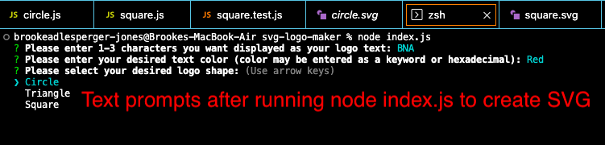
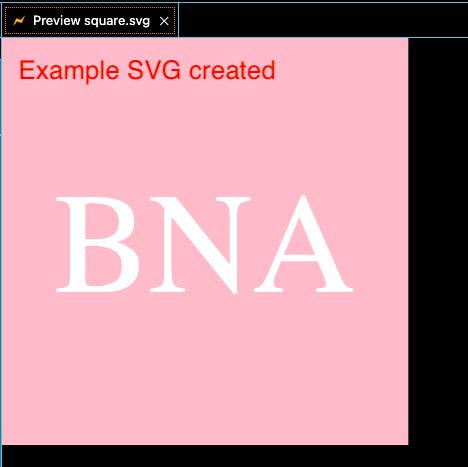

# module-four-challenge
Coding Bootcamp Module Four Challenge

## Description

The goal of this project was to create an application to create a custom SVG image. 

## Installation

N/A

## Usage

The usage of this application is to give users an easy way to create a customized SVG file. A user can run the logo maker by running node index.js in the terminal and answer all question prompts. After answering the questions the logo will be created and automatically saved as a logo.svg file. 

## Credits

N/A

## License

Please refer to the license in the repo
